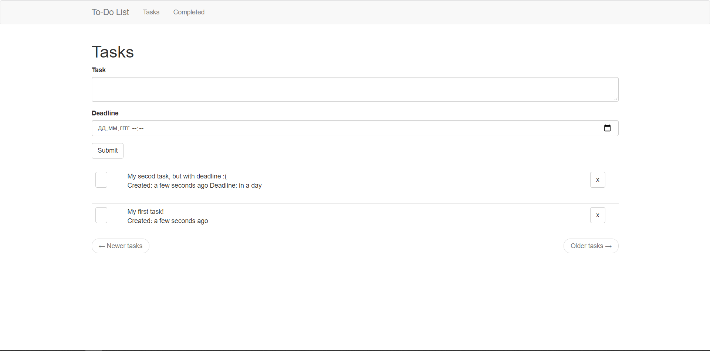

# To-Do List web app.
Simple web-app done while waiting for another program to parse HTML-files :) Docker added!


## Start on Linux
```bash
python3 -m venv venv
source venv/bin/activate
venv/bin/python -m pip install --upgrade pip
pip install -r requirements.txt
export FLASK_APP=todolist.py
flask run
```

## Start on Windows
```bash
python3 -m venv venv
venv\bin\Activate
set FLASK_APP=todolist.py
venv\Scripts\python.exe -m pip install --upgrade pip
pip intall -r requirements.txt
flask run
```

## Start on Linux with Docker
```bash
docker build -t todolist:latest
docker run --name todolist -d -p 5000:5000 --rm todolist:latest
```
